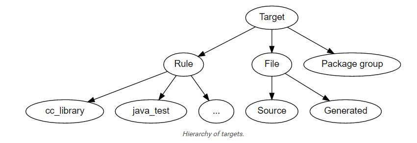

# Bazel: 概念と用語

## イントロダクション

Bzaelは、workspaceと呼ばれるディレクトリに構成されるソースコードから、ソフトウェアをビルドする。
ワークスペース内のソースコードは、パッケージの階層のネストにより構成されており、各パッケージは関連するソースファイルと、BUILDファイルが含まれるディレクトリである。
BUILDファイルは、ソフトウェアがビルドによって何を生成するかを示している。

## ワークスペース、パッケージ、ターゲット

### ワークスペース

ワークスペースはファイルシステム中のビルドしたいソフトウェアのソースコードが格納されているディレクトリであり、同様にビルドされた出力ファイルを含んでいるディレクトリへのリンクも同様である。
各ワークスペースディレクトリには、WORKSPACEというテキストファイルが格納されている。WORKSPACEファイルは、空のファイルか、出力ファイルをビルドするための外部依存が記述されている。

### パッケージ

ワークスペース中の基本となるコードの構成谷はパッケージである。
パッケージは、関連するファイルと依存関係を指定したファイルの一群である。

パッケージは、BUILDと呼ばれるファイルを含んでいるディレクトリとして定義され、WORKSPACEをトップディレクトリとして、その配下に配置される。
パッケージには、そのディレクトリに含まれる全てのファイルが含まれており、またサブディレクトリもパッケージの一部である。
しかし例外的にサブディレクトリのBUILDファイル自身はパッケージの一部ではない。

例えば、下記のファイルツリーの場合、

```
src/my/app/BUILD
src/my/app/app.cc
src/my/app/data/input.txt
src/my/app/tests/BUILD
src/my/app/tests/test.cc
```

2つのパッケージが含まれている。```my/app```と```my/app/tests```サブパッケージである。```my/app/data```はパッケージではないが、```my/app```ディレクトリに属している。

### ターゲット

パッケージはコンテナである。
パッケージの各要素のことをターゲットと呼ぶ。
殆どのターゲットは、ファイルかルールのどちらかの種類として区別される。
加えて別のターゲットの種類として、パッケージグループが存在するが、これはあまり登場しない。



ファイルは大きく2種類に分類される。
ソースファイルは、一般的に人間によって書かれ、リポジトリにチェックインされる。
生成ファイルされたファイルはチェックインされないが、特定のルールに従ってソースファイルからビルドツールによって生成されるものである。

ターゲットの2番目の種類は、ルールである。
ルールは、入力ファイルと出力ファイルの関係を指定し、入力ファイルから出力ファイルを得るために必要なステップを含む。
ルールの出力は、常に生成されたファイルである。
ルールの入力は、おそらくはソースファイルであるが、生成ファイルも含まれることがある; つまり、ルールの出力は、他のルールの入力となることがあり、ルールによる長いチェインが構成されることがある。

Whether the input to a rule is a source file or a generated file is in most cases immaterial; what matters is only the contents of that file. This fact makes it easy to replace a complex source file with a generated file produced by a rule, such as happens when the burden of manually maintaining a highly structured file becomes too tiresome, and someone writes a program to derive it. No change is required to the consumers of that file. Conversely, a generated file may easily be replaced by a source file with only local changes.

ルールへの入力が、ソースファイルであるか生成ファイルであるかは、殆どの場合において重要ではない; 重要なのはファイルの中身である。
この事実により、膨大かつ構造化されたファイル群を手動で管理するのが非常に面倒な複雑なソースファイルを、ルールにより生成されたファイルに置き換えることとで、問題を簡単にする。xxx
このファイルの使用者は、何かをする必要はない。
逆に、生成されたファイルは、ローカルの変更のみでソースファイルへと簡単に置換することができる。

ルールへの入力に、他のルールが含まれていることがある。
このような関係性のより正確な意味は非常に複雑かつ言語、ルールに依存することであるが、直感的に考えると簡単なことである: C++ライブラリのルールAは、他のC++のライブラリのルールBを入力として持つ、ということである。
この依存関係の効果は、Aのコンパイル中にBのヘッダファイルが必要なときや、Aのリンク中にBのシンボルが必要な時やAを実行中にBのランタイムデータが使用可能になる、ということである。

全てのルールにおいて、共通して言えることは、ルールにより生成されたファイルは、ルール自身として、同一のパッケージに所属する、ということである; 生成したファイルを、他のパッケージに格納することはできない。
同様に、ルールの入力が他のパッケージから来ることもない。


パッケージグループは、特定のルールへのアクセス性を制限するための目的のパッケージ群である。
パッケージグループは、package_group関数により定義される。
これには、2つのプロパティが存在する: パッケージのリストと、パッケージの名前である。
これらを参照するための唯一の方法は、ルールのvisibility属性によるものか、package関数に属するdefault_visibility属性によるものである; これらはファイル自身を生成しない。
より詳細には、Build Encyclopediaの適切なセクションを参照すること。

### ラベル

すべてのターゲットは、正確に1つのパッケージに属する。
ターゲットの名前はそのラベルで呼ばれ、典型的なラベルは以下のような形式で表現される。

```
//my/app/main:app_binary
```

それぞれのラベルは2つの部分を持っており、パッケージの名前(my/app/main)とターゲット名(app_binary)である。
すべてのラベルはターゲットによりここに識別される。
ラベルは時々別の形式で表現される; コロンが無い形式では、ターゲット名は、パッケージ名の最後のコンポーネントと同じである。したがって、以下の2つのラベルは同一である。

```
//my/app
//my/app:app
```

//my/appのような短縮形式のラベルはパッケージ名により混乱させることが無い。
ラベルは//から始まるが、パッケージ名はそうではない。したがって```my/app```は```//my/app```に含まれるパッケージである。
(よくある誤解としては、``//my/app```はパッケージであるか、パッケージ内のすべてのターゲットを示している、というものであるが、どちらも間違いである)


BUILDファイルには、ラベルの部分を除去こともあるパッケージ名と、オプションとしてコロンが置かれる。
したがって、パッケージmy/appのためのBUILDファイル(例えば、//my/app:BUILD)には、以下のような「相対的な」はすべて同一である。

```
//my/app:app
//my/app
:app
app
```

(利便性のため、ファイルの指定にはコロンを除去することができるが、コロンのルールは残っている。しかしコロンが無くてもそれほど重要なことではない。)

同様に、BUILDファイルには、パッケージに含まれるファイルがパッケージディレクトリからの相対パスとして簡潔な形式で記述されている。

```
generate.cc
testdata/input.txt
```

しかし他のパッケージもしくはコマンドラインからは、これらのファイルのターゲットはすべて完全なラベルの形式、例えば```//my/app:generate.cc```として参照されなければならない。

相対的なラベルは、他のパッケージ中のターゲットを参照するのには使えない; この場合には完全なパッケージ名を指定しなければならない。
例えば、ソースツリーにパッケージmy/appとパッケージmy/app/testdataが存在していたとする(例えば、これらの2つのパッケージがそれぞれ独自のBUILDファイルを持っていたとする)
後者のパッケージには、testdepot.zipが含まれている。
ここで、my/app:BUILDからこのファイルを参照するのには、2つの手法があるかもしれない(1つは間違っており、1つは正しい):

```
testdata/testdepot.zip  # Wrong: testdata is a different package.
//my/app/testdata:testdepot.zip   # Right.
```

もし誤ってtestdepot.zipを誤った方法で参照したならば、(例えば//my/app:testdata/testdepot.zip や //my:app/testdata/testdepot.zip)、ビルドツールはラベルが"crosses a package boundary"であるとのエラーを出力するだろう。
ラベルを修正し、内部のBUILDファイルが存在しているディレクトリの後にコロンを付加し、ファイル名を指定する必要がある。

Lexical specification of a label

#### ラベルの文法的な仕様

ラベルの構文は、意図的に厳密に定義されており、これによりシェルに特殊なメタ文字を渡されることを禁止している。
これにより不注意により発生する問題を防いでおり、Bazel Query Languageのような、ラベルを操作するためのツールやスクリプトの作成を容易にしている。
ラベルでは、以下の文字はすべて禁止されている: 任意の空白文字、大かっこ、中かっこ、小かっこ; *のようなワイルドカード、>, &, | などのシェルのメタ文字。
これらのリストは厳密ではないので、正確な詳細を以下に示す。

##### ターゲット名 , ```//...:target-name```

ターゲット名は、パッケージ内のターゲットの名前である。
名前のルールは、BUILDファイル中のルール宣言部のnameパラメータの値と同一である;ファイルの名前は、BUILDファイルが含まれているディレクトリからの相対パスである。
ターゲット名はa-z, A-Z, 0-9と_/.+-=,@~で構成される句読点で構成されていなければならない。
他のパッケージやファイルを参照するために..を使ってはならない; その代わりに、//packagename:filenameを利用すること。
filenameは一般的な形式での相対パスでなければならず、したがってスラッシュで始まっても終わってならない(例: /fooやfoo/は禁止である)し、複数のスラッシュをパスに挿入してはならない(例: foo//bar)。
同様に、上位のディレクトリを参照する(..)や、現在のディレクトリを参照する(./)のも禁止である。
ターゲットが含むことができるこれらの唯一の例外は、正確に"."のみである。

ファイルターゲットの名前として/を含むことが一般的だが、Bazelでは/を名前のルールとして使用することを避けるように推奨している。
特にラベルの短縮形を使用している場合は、読者を混乱させることがある。
ラベル//foo/bar/wizは、foo/bar/wizというパッケージが存在しないとしても、常に//foo/bar/wiz:wizの短縮形であり; ターゲットが存在したとしても、//foo:bar/wizという参照にはならない。

しかし、スラッシュを利用した方が便利な場合も時として存在するか、時々必要になることがある。
例えば、特定のルールの名前が主たるソースファイルにマッチさせなければならない場合であり、パッケージのサブディレクトリに存在している場合である。

##### パッケージ名, ```//package-name:...```

パッケージめいっは、BUILDファイルが含まれているディレクトリの名前であり、ソースツリーのトップレベルからの相対的な場所で示される。
例としてmy/appと表記することができる。
パッケージ名は、ASCII文字の小文字から始まらなければならず、a-z, 0-9, '_', and '/'から構成されている。

ディレクトリの構成がそのモジュールシステムにとって重要であるような言語(例: Java)である場合、言語にとって有効な識別子を持つディレクトリ名を選択することは重要である。

Bazelはビルドルートにパッケージを持つことを認めているが、これは推奨されているものでは無く、プロジェクトはより記述的なパッケージ名を使うべきである。

パッケージ名には//を含むことはできず、またスラッシュで終了することもできない。

#### ルール

A rule specifies the relationship between inputs and output, and the steps to build the outputs. Rules can be of one of many different kinds or classes, which produce compiled executables and libraries, test executables and other supported outputs as described in the Build Encyclopedia.

ルールは入力と出力の関係、および出力を生成するためのステップを記述する。
ルールはさまざまな異なる種類、もしくはクラスから選択することができ、実行ファイルや、ライブラリをコンパイルしたり、実行ファイルをテストしたり、そのほかにもBuild Encyclopediaに記述された様々な出力を生成することができる。

Every rule has a name, specified by the name attribute, of type string. The name must be a syntactically valid target name, as specified above. In some cases, the name is somewhat arbitrary, and more interesting are the names of the files generated by the rule; this is true of genrules. In other cases, the name is significant: for *_binary and *_test rules, for example, the rule name determines the name of the executable produced by the build.

すべてのルールには名前がついており、```name```属性の文字列により指定されている。
名前には上記に示したような、文法的に有効なターゲット名を指定しなければならない。
いくつかの場合には、名前は任意のものを設定することができ、より面白いことに、ルールにより生成されるファイル名も指定することができる; これはgenruleにおいて真である。
ほかの場合には、名前は重要である: 例えば*_binary と　*_testのルールではルールの名前はビルドにより生成された実行ファイルの名前を決定する。


すべてのルールは属性の集合を持っている; ルールにより指定された属性を設定でき、各属性の重要度と文法は各ルールのクラスの機能である；Build Encyclopediaにすべてのサポートされたルールと該当する属性が記述されている。
各属性は名前とタイプを持っている。
指定できるタイプは; integer, label, list of labels, string, list of strings, output label, list of output labelsである。
すべてのルールにおいて、すべての属性を指定する必要はない。
Attributes thus form a dictionary from keys (names) to optional, typed values.　属性はキー(名前)のによってはオプションであり、型付けられた値であるxxx。

srcs属性は、"list of label"の属性のさまざまなルールを示している; もし使用するならば、その値はラベルのリストであり、このルールに入力される各ターゲットの名前である。

The outs attribute present in many rules has type "list of output labels"; this is similar to the type of the srcs attribute, but differs in two significant ways. Firstly, due to the invariant that the outputs of a rule belong to the same package as the rule itself, output labels cannot include a package component; they must be in one of the "relative" forms shown above. Secondly, the relationship implied by an (ordinary) label attribute is inverse to that implied by an output label: a rule depends on its 'srcs', whereas a rule is depended on by its outputs. The two types of label attributes thus assign direction to the edges between targets, giving rise to a dependency graph.

outs属性は"list of labels"の属性のさまざまなルールを示している; これはsrc属性と似ているが、2つの部分で大きく異なっている。
最初に、出力のルールは、ルール自身で同一のパッケージ内に属していなければならないというルールがあるため、出力のラベルにはpackageコンポーネントを含むことができない; 上記に示した「相対的な」パスの1つを利用しなければならない。
2つ目は、(最初に)ラベル属性として示された関係は、出力ラベル: srcsに依存するルール、として示されたものとは逆である。一方でルールはその出力に依存する。
したがって、2種類のラベル属性は、ターゲット間で方向性を持つ依存関係が指定され、依存関係グラフを生成できる。

The figure below represents an example fragment of the build dependency graph, and illustrates: files (circles) and rules (boxes); dependencies from generated files to rules; dependencies from rules to files, and from rules to other rules. Conventionally, dependency arrows are represented as pointing from a target towards its prerequisites.

以下の図は、ビルドの依存関係を示したグラフである: ファイル(丸で示されたもの)とルール(四角で示されたもの)から構成されている; ルールから生成されたファイルの依存関係と、ルールからファイルへの依存関係と、ルールからルールへの関係である。
読みやすさのため、依存関係のグラフはターゲットから依存元への矢印として表現される。


このようなターゲットの有効非循環グラフを「ターゲットグラフ」もしくは「ビルド依存関係グラフ」と呼び、Bazel Query toolの領域で使用される。
